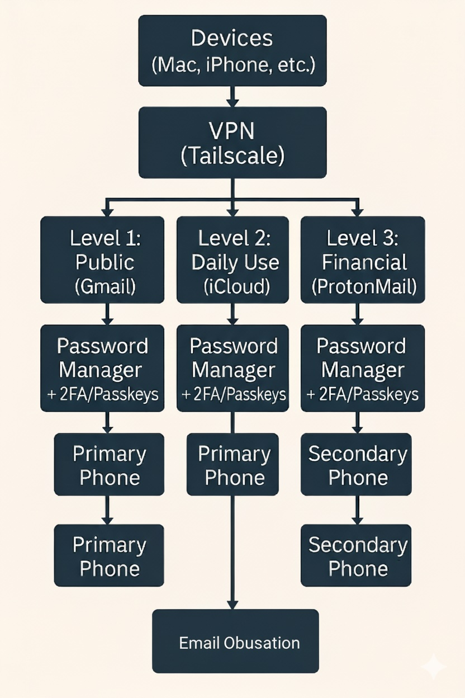

# Personal Digital Security

*Oct. 2024*

This project documents the implementation of a robust personal security model to minimize the attack surface and regain control over the digital footprint.

## Implemented Solution

*   **Identity and Access Management:**  
    * Adopted iCloud Keychain as the centralized password manager, leveraging end-to-end encryption and native integration.  
    * Migrated all accounts to the manager, generating unique and complex passwords for each service.  
    * Enabled integrated 2FA codes wherever possible and prioritized the use of passkeys for compatible services.  
    * Segmented email usage by trust level: Gmail for public registrations, iCloud Mail for daily/professional use, and Proton Mail for financial services.  
    * Used "Hide My Email" to generate unique aliases, protecting real email addresses.  
    * Reduced attack surface by auditing and closing unnecessary online accounts.  
    * Isolated phone numbers, acquiring a second line for financial verifications.

*   **Environment and Network Hardening:**  
    * Maintained strict endpoint security on Apple devices: always-on firewall, immediate software updates, and regular device reboots.  
    * Deployed Tailscale VPN across all devices, creating a personal security perimeter.  
    * Integrated NextDNS for network-level filtering, blocking trackers, malware, and phishing at both router and device level.  
    * Avoided connections to public or untrusted Wi-Fi networks.

## Project Results

*   **Greater Control and Security:** Achieved full control over digital identity and personal data.
*   **Reduced Exposure:** Substantially minimized threats through segmentation, strong authentication, and proactive account management.
*   **Scalable Model:** Established a security model adaptable to future needs.
